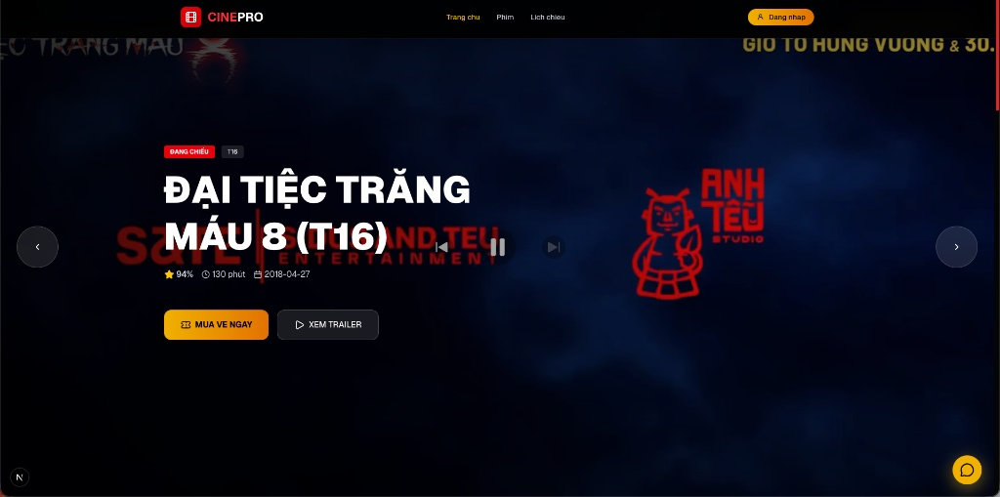

# CINEPRO - Nền Tảng Đặt Vé Xem Phim Trực Tuyến

CINEPRO là một ứng dụng web hiện đại giúp người dùng dễ dàng theo dõi lịch chiếu, khám phá các bộ phim bom tấn mới nhất và thực hiện đặt vé xem phim trực tuyến một cách nhanh chóng, tiện lợi. Dự án sở hữu giao diện tối (Dark Mode) rực rỡ, tối ưu trải nghiệm điện ảnh cho người dùng.

---

## 📸 Giao diện dự án (Screenshots)


*Giao diện trang chủ với Slider Banner hiển thị phim hot*

---

### 🖥️ Giao diện người dùng (Frontend)
*   **Hero Slider thông minh:** Banner trang chủ hiển thị các bộ phim đang chiếu nổi bật kèm hiệu ứng mượt mà, tích hợp bộ điều khiển Play/Pause/Next/Prev và hiển thị nhanh thông tin phim (Thời lượng, Điểm đánh giá, Ngày khởi chiếu).
*   **Hệ thống phân loại phim trực quan:** Gắn nhãn phân loại phim rõ ràng (ví dụ: `ĐANG CHIẾU`, nhãn giới hạn độ tuổi `T16`).
*   **Trải nghiệm người dùng mượt mà:** 
    *   Nút bấm **MUA VÉ NGAY** nổi bật thúc đẩy hành động (Call-to-Action).
    *   Xem trailer trực tiếp thông qua cửa sổ Modal (`XEM TRAILER`).
    *   Tích hợp Live Chat hỗ trợ nhanh cho khách hàng (nút chat góc phải dưới màn hình).
*   **Responsive Design:** Tối ưu hóa giao diện hiển thị đẹp mắt trên cả Máy tính, Máy tính bảng và Điện thoại di động.

### ⚙️ Tính năng hệ thống (System Features)
*   **Hệ thống xác thực (Authentication):** Đăng nhập và quản lý tài khoản thành viên để tích điểm, xem lịch sử đặt vé.
*   **Điều hướng thông minh:** Thanh điều hướng (Navbar) tinh gọn bao gồm Trang chủ, Phim, Lịch chiếu giúp người dùng tìm kiếm thông tin mong muốn chỉ với 1 cú click.


---

# 🛠️ Tech Stack

## Backend

* NestJS
* Node.js
* TypeScript

## Database

* PostgreSQL
* TypeORM

## Authentication & Security

* JWT Authentication
* Google OAuth2 Login
* Role-Based Access Control (RBAC)

## Payment

* PayOS Integration

## Email & Notification

* Nodemailer
* QRCode Generator

## Media & Storage

* Cloudinary

## Deployment

* Docker
* VPS Deployment

---

# 🏗️ Architecture & Main Features

## 🌟 Main Features

### 👤 Authentication & Authorization

* Register/Login with JWT
* Google OAuth2 Login
* Role-based permissions:

  * ADMIN
  * STAFF
  * USER

---

### 🎥 Movie Management

* Create / Update / Delete movies
* Upload movie poster & trailer
* Movie detail API
* Weekly movie schedule

---

### 🕒 Showtime Management

* Create showtime manually
* Auto generate showtime schedule
* Draft showtime workflow
* Publish draft showtimes
* Weekly showtime API for users

---

### 🪑 Seat Management

* Auto generate room seats
* VIP / STANDARD / COUPLE seats
* Seat locking system
* Seat release system

---

### 🎟️ Booking System

* Create booking
* Booking history
* Cancel booking
* Booking lookup by code

Booking Flow:

```text
Select Showtime
→ Lock Seats
→ Create Booking (PENDING)
→ Create Payment
→ Payment Success
→ Confirm Booking
→ Generate Ticket
→ Send Ticket Email
```

---

### 💳 Payment System

* PayOS Integration
* MOMO / Banking / QR Payment
* Payment webhook handling
* Auto booking confirmation

Payment Flow:

```text
Create Booking
→ Create PayOS Payment
→ User Payment
→ PayOS Webhook
→ Booking PAID
→ Seats SOLD
```

---

### 📧 E-Ticket System

* Generate ticket after payment
* Generate QR Code ticket
* Send ticket via email
* Staff QR ticket verification

Ticket Status:

* VALID
* USED
* CANCELLED

---

# 🗂️ Folder Structure

```bash
src/
│
├── auth/           # Authentication & Authorization
├── booking/        # Booking management
├── cinema/         # Cinema management
├── common/         # Shared utilities, constants, helpers
├── config/         # App & environment configuration
├── dashboard/      # Dashboard & statistics
├── mail/           # Email service & templates
├── migrations/     # Database migrations
├── movie/          # Movie management
├── notification/   # Notifications system
├── payment/        # PayOS payment integration
├── product/        # Products / combos / food
├── seeds/          # Seed data
├── showtime/       # Showtime & seat logic
├── ticket/         # Ticket & QR verification
├── user/           # User management
│
├── app.controller.ts
├── app.module.ts
├── app.service.ts
└── main.ts
```

---

# 🚀 Getting Started

## Install dependencies

```bash
npm install
```

# 👨‍💻 Contributors

* Nguyễn Sơn
* CINEPRO Development Team


